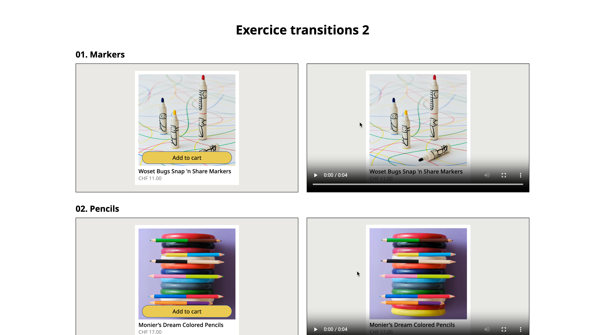

# Exercice transitions 2

## Installation

1. Cloner le repository
2. Ouvrir le dossier avec Visual Studio Code
3. Ouvrir une fenêtre de terminal dans Visual Studio Code et entrer la commande suivante :

```bash
npm install
```

## Travail

Depuis le terminal, entrer la commande suivante :

```bash
npm run dev
```

## Consigne

Ajoutez les effets au survol visibles dans les vidéos de la colonne de droite.

☝️ Vous n'avez pas besoin de modifier le HTML ni de modifier la CSS existante. Ajoutez simplement la CSS nécessaire.

☝️ Des variables contenant les couleurs à utiliser se trouvent au début de _main.scss_.

## Aperçu


